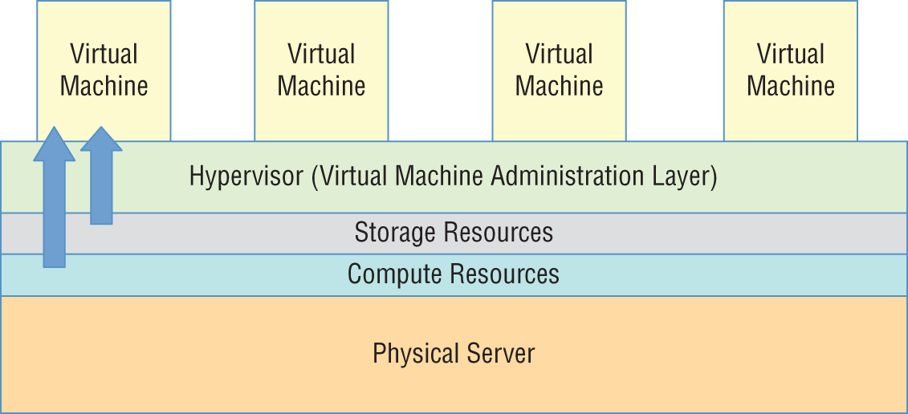
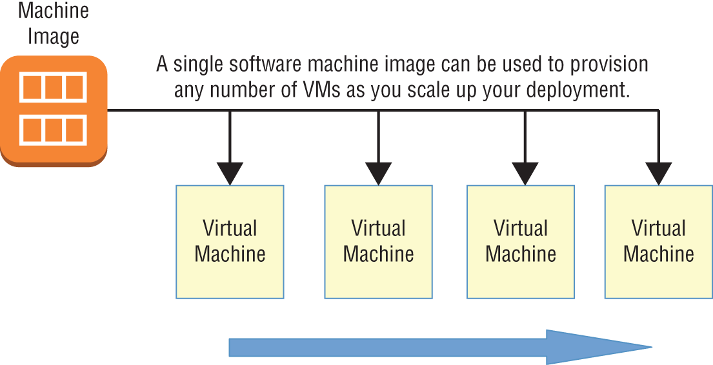

# AWS-Certified-Solutions-Architect

AWS Certified Solutions Architect : Associate SAA‐C02 Exam

## The Core AWS Services

## Cloud Computing and Virtualization

* The technology that lies at the core of all cloud operations is virtualization.

* Virtualization lets you divide the hardware resources of a single physical server into smaller units.

* That physical server could therefore host multiple virtual machines (VMs) running their own complete operating systems, each with its own memory, storage, and network access.

### Virtual Machine

### AWS Cloud VM

