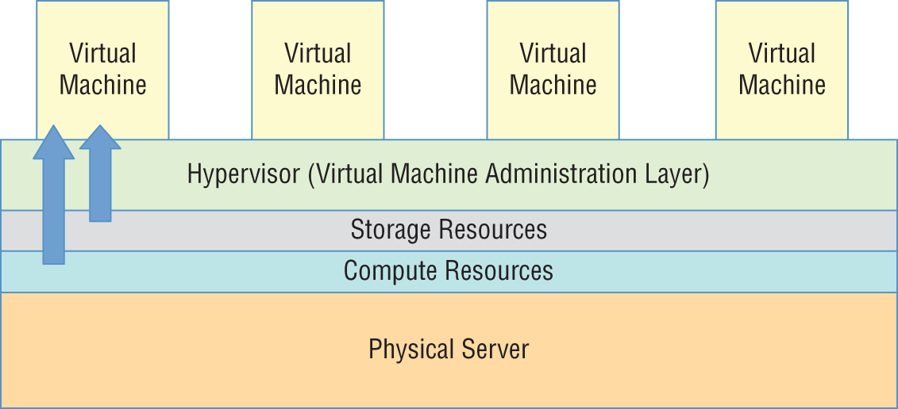
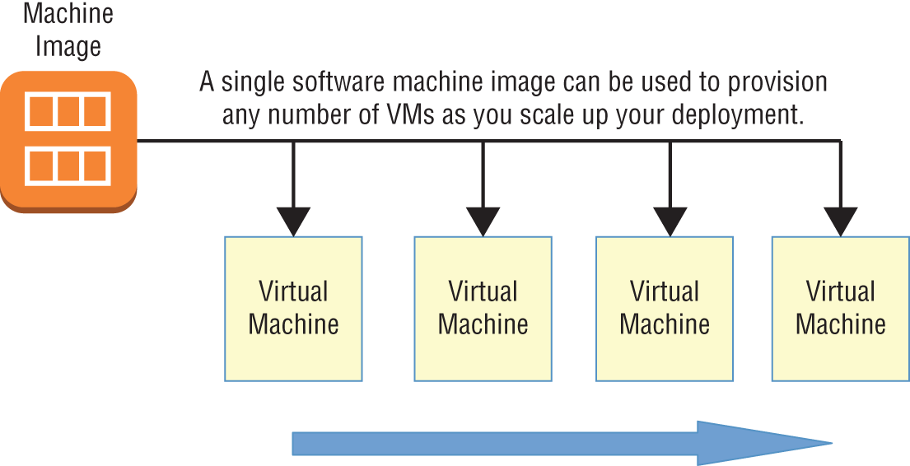
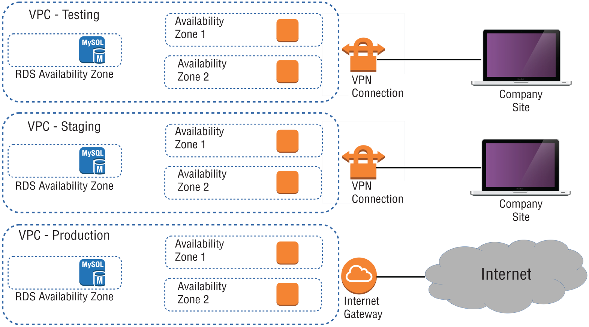

# AWS-Certified-Solutions-Architect

## The Core AWS Services

## Cloud Computing and Virtualization

* The technology that lies at the core of all cloud operations is virtualization.

* Virtualization lets you divide the hardware resources of a single physical server into smaller units.

* That physical server could therefore host multiple virtual machines (VMs) running their own complete operating systems, each with its own memory, storage, and network access.

### Virtual Machine

> Virtualization's flexibility makes it possible to provision a virtual server in a matter of seconds, run it for exactly the time your project requires, and then shut it down. The resources released will become instantly available to other workloads. 
> The usage density you can achieve lets you squeeze the greatest value from your hardware and makes it easy to generate experimental and sandboxed environments.



### AWS Cloud VM

#### Cloud Computing Architecture

> Major cloud providers like AWS have enormous server farms where hundreds of thousands of servers and disk drives are maintained along with the network cabling necessary to connect them. A well‐built virtualized environment could provide a virtual server using storage, memory, compute cycles, and network bandwidth collected from the most efficient mix of available sources it can find.

> A cloud computing platform offers on‐demand, self‐service access to pooled compute resources where your usage is metered and billed according to the volume you consume. Cloud computing systems allow for precise billing models, sometimes involving fractions of a penny for an hour of consumption



## AWS Platform Architecture

> AWS maintains data centers for its physical servers around the world. Because the centers are so widely distributed, you can reduce your own services' network transfer latency by hosting your workloads geographically close to your users. 

> It can also help you manage compliance with regulations requiring you to keep data within a particular legal jurisdiction.

> Data centers exist within AWS regions, of which there are currently 21—not including private U.S. government AWS GovCloud regions—although this number is constantly growing. 

> It's important to always be conscious of the region you have selected when you launch new AWS resources; pricing and service availability can vary from one to the next

## Amazon Elastic Compute Cloud and Amazon Elastic Block Store (EC2 And EBS)


### Domain 1: Design Resilient Architectures

        1.1 Design a multi‐tier architecture solution

        1.2 Design highly available and/or fault‐tolerant architectures

        1.4 Choose appropriate resilient storage

### Domain 2: Design High‐Performing Architectures

        2.1 Identify elastic and scalable compute solutions for a workload

        2.2 Select high‐performing and scalable storage solutions for a workload

### Domain 3: Design Secure Applications and Architectures

        3.1 Design secure access to AWS resources

### Domain 4: Design Cost‐Optimized Architectures

        4.1 Identify cost‐effective storage solutions

        4.2 Identify cost‐effective compute and database services

        4.3 Design cost‐optimized network architectures

## Introduction
The ultimate focus of a traditional data center/server room is its precious servers. But, to make those servers useful, you'll need to add racks, power supplies, cabling, switches, firewalls, and cooling.

#### AWS's Elastic Compute Cloud (EC2) is designed to replicate the data center/server room experience as closely as possible. 

At the center of it all is the EC2 virtual server, known as an instance. But, like the local server room I just described, EC2 provides a range of tools meant to support and enhance your instance's operations

```
1. Provisioning an EC2 instance with the right hardware resources for your project
2. Configuring the right base operating system for your application needs
3. Building a secure and effective network environment for your instance
4. Adding scripts to run as the instance boots to support (or start) your application
5. Choosing the best EC2 pricing model for your needs
6. Understanding how to manage and leverage the EC2 instance lifecycle
7. Choosing the right storage drive type for your needs
8. Securing EC2 resources using key pairs, security groups, network access lists, and Identity and Access Management (IAM) roles
9. Scaling the number of instances up and down to meet changing demand using Auto Scaling
10. Accessing your instance as an administrator or end‐user client
```
### EC2 Instances

> An EC2 instance may only be a virtualized and abstracted subset of a physical server, but it behaves just like the real thing.

> It will have access to storage, memory, and a network interface, and its primary storage drive will come with a fresh and clean operating system running.

> It's up to you to decide what kind of hardware resources you want your instance to have, what operating system and software stack you'd like it to run, and, ultimately, how much you'll pay for it. Let's see how all that works

1. Provisioning and EC2 Instance

   1.1 EC2 Amazon Machine Images

        1.1.1 Amazon Quick Start AMIs

        1.1.2 AWS Marketplace AMIs

        1.1.3 Community AMIs

        1.1.4 Private AMIs
 
 A particular AMI will be available in only a single region—although there will often be images with identical functionality in all regions.
 Keep this in mind as you plan your deployments: invoking the ID of an AMI in one region while working from within a different region will fail
 
#### AN IMPORTANT NOTE ABOUT BILLING
> Besides the normal charges for running an EC2 instance, your AWS account might also be billed hourly amounts or license fees for the use of the AMI software itself.
 
> Although vendors make every effort to clearly display the charges for their AMIs, it's your responsibility to accept and honor those charges.

### Instance Types

> AWS allocates hardware resources to your instances according to the instance type—or hardware profile—you select

EC2 instance type family and their top‐level designations

| Instance type family	 |       Types                                    |
|------------------------|------------------------------------------------|
| General purpose	 |       A1, T3, T3a, T2, M6g, M5, M5a, M5n, M4   |
| Compute optimized	 |       C5, C5n, C4                              |
| Memory optimized	 |       R5, R5a, R5n, X1e, X1, High Memory, z1d  |
| Accelerated computing	 |       P3, P2, Inf1, G4, G3, F1                 |
| Storage optimized	 |       I3, I3en, D2, H1                         |

### Configuring an Environment for Your Instance

Deciding where your EC2 instance will live is as important as choosing a performance configuration. 

Here, there are three primary details to get right

       1. Geographic region, 
       2. Virtual private cloud (VPC), and 
       3. Tenancy model.

## AWS Regions

> As you learned earlier, AWS servers are housed in data centers around the world and organized by geographical region. You'll generally want to launch an EC2 instance in the region that's physically closest to the majority of your customers or, if you're working with data that's subject to legal restrictions, within a jurisdiction that meets your compliance needs.

> EC2 resources can be managed only when you're “located within” their region. You set the active region in the console through the drop‐down menu at the top of the page and through default configuration values in the AWS CLI or your SDK. You can update your CLI configuration by running aws configure.

> Keep in mind that the costs and even functionality of services and features might vary between regions. It's always a good idea to consult the most up‐to‐date official documentation.

## VPCs

> Virtual private clouds (VPCs) are easy‐to‐use AWS network organizers and great tools for organizing your infrastructure. Because it's so easy to isolate the instances in one VPC from whatever else you have running, you might want to create a new VPC for each one of your projects or project stages. 

> For example, you might have one VPC for early application development, another for beta testing, and a third for production



## Tenancy

> When launching an EC2 instance, you'll have the opportunity to choose a tenancy model. 

> The default setting is shared tenancy, where your instance will run as a virtual machine on a physical server that's concurrently hosting other instances. Those other instances might well be owned and operated by other AWS customers, although the possibility of any kind of insecure interaction between instances is remote.

> To meet special regulatory requirements, your organization's instances might need an extra level of isolation. The Dedicated Instance option ensures that your instance will run on a dedicated physical server. This means that it won't be sharing the server with resources owned by a different customer account. 

> The Dedicated Host option allows you to actually identify and control the physical server you've been assigned to meet more restrictive licensing or regulatory requirements.

>Naturally, dedicated instances and dedicated hosts will cost you more than instances using shared tenancy.

## Pricing estimates comparing on‐demand with reserve costs


